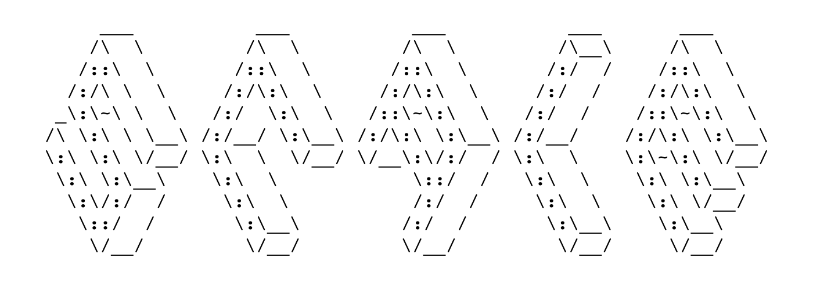

The `scale` library offers a set of customizable UI components written in `TypeScript`. The default `theme` of the library can be easily replaced so that a corresponding corporate identity of a dedicated brand can be represented.

   

## Scale Monorepo

### Setup

This repository uses `lerna` and `typescript`

#### Package overview
|Package name       |Description|
|---                |---|
|components         |Stencil components|
|components-react   |Component binding for React (auto-generated)|
|config             |Shared configuration across packages|
|gatsby-plugin      |Plugin to enable SSR for Gatsby apps|
|nuxt-module        |Plugin to enable SSR for Nuxt apps|

### Running locally

#### 1. Clone this repository to a local folder of your choice

```bash
cd path-to/folder-name
git clone git@github.com:telekom/scale.git
cd scale
```

#### 2. Install dependencies

This repository uses `yarn lerna`, for the symlinks to work correctly we use `yarn` in favour of `npm`

```bash
yarn bootstrap
```

#### 3. Build packages

```bash
# build
yarn build
```

### Contributing

#### Pull requests

When opening a new PR it is advised to branch off the latest `master` branch. We loosely follow the `Git flow` standards for branch naming e.g. `feat|feature`, `fix`, `chore`, `test` etc. All pull requests are then merged into `master` and released through the `CI` pipeline via the `release` branch.

#### Tests

When developing new features or components it is required to provide `unit tests` and `end to end` tests if appropriate and aim at 100% test coverage. In addition we use `screenshot tests` for components via `jest-image-snapshot`. Stencil uses `Jest` as the testing framework, please take a look at the existing components as an example or visit the official documentation:

- https://stenciljs.com/docs/testing-overview
- https://jestjs.io/

#### Development Tooling

We strongly recommend you use the `VSCode text editor` since most of our code is written in `Typescript` and it offers amazing support for the language.
